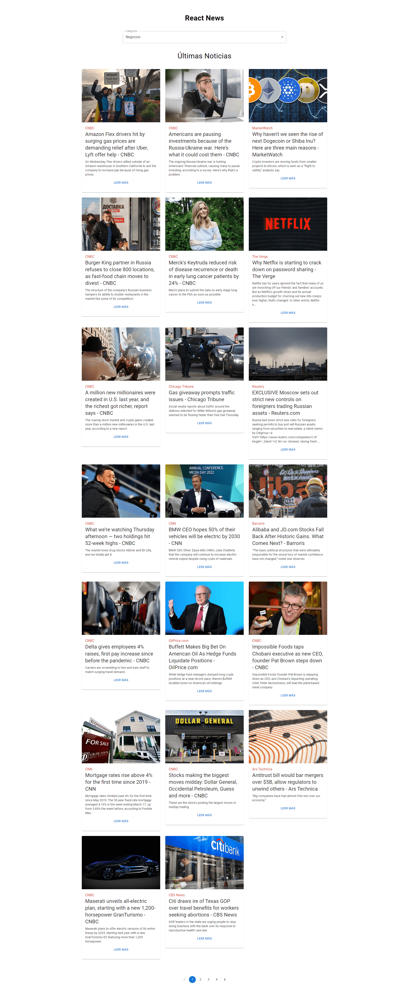

# Noticias React

## Aplicación de noticias desarrolla con React

___Por restricciones de la API, la aplicación solo funciona le localhost___

&nbsp; 

    - React
    - Hooks
    - Contex
    - Axios
    - Material UI

&nbsp; 

~~~ 
API: https://newsapi.org/
~~~

&nbsp; 

## Para ver el proyecto en funcionamiento siga los siguientes pasos:

1. Clone el repositorio
~~~ 
git clone https://github.com/tonatiujsanchez/clima-react.git
~~~ 

2. Acceda a la carpeta del proyecto
~~~ 
cd clima-react
~~~ 
3. Instale los paquetes de Node
~~~
npm install
~~~
4. Por último levante el servidor para ver el proyecto en funcionamiento
~~~
npm run dev
~~~

&nbsp;

## Vista previa 👇

&nbsp;
